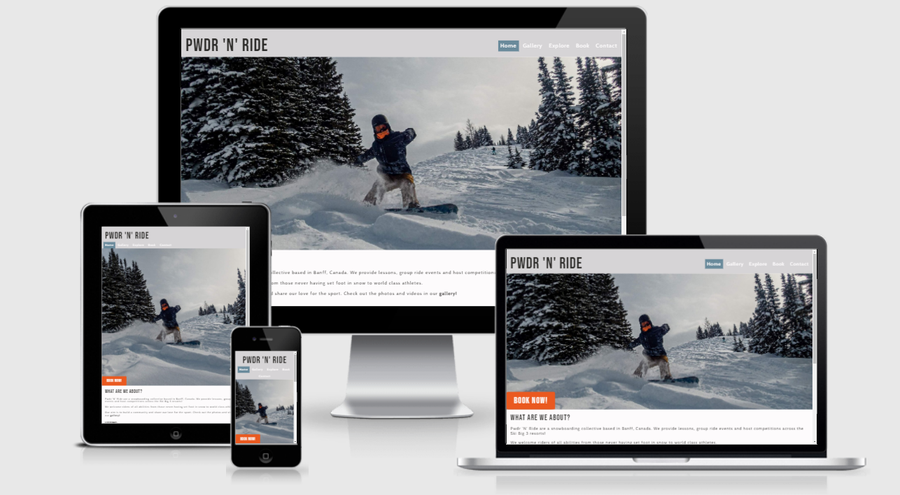

# Pwdr 'N' Ride

This website was built for a new snowboarding school based in Banff, Canada. The site is targeted at new and existing snowboarders looking for lessons, local events and a chance to meet likeminded people. It will provide users useful information on when, where and how much they should expect to pay to be invovled with the Pwdr 'N' Ride community. 

This website was made as fulfillment of the Milestone Project 1 for the Full-Stack Software Development Course provided by Code Institute. It was made solely using HTML and CSS with good User Design at the forefront of the focus. 

The live website can be found [here](https://tdawes93.github.io/pwdr-n-ride/)

## Table of Contents

- [UX Desgin](#UX-Design)
    - [User Stories](#User-Stories)
    - [Structure](#Structure)
    - [Design](#Design)
        - [Colour Scheme](#Colour-Scheme)
        - [Typography](#Typography)
        - [Imagery](#Imagery)
    - [Wireframes/Skeleton](#Wireframes/Skeleton)
    - [Differences in finished site](#Differences-in-finished-site-to-initial-design)
    - [Limitations](#Limitations)
- [Features](#Features)
    - [Home Page](#Home-Page)
    - [Gallery](#Gallery)
    - [Explore Page](#Explore-Page)
    - [Booking Page](#Booking-Page)
    - [Future Features](#Future-Features-to-Implement)
- [Technologies](#Technologies)
    - [Languages](#Languages)
    - [Tools](#Tools)
- [Testing](#Testing)
    - [Overview](#Overview)
    - [Validator Testing](#Validator-Testing)
    - [Issues/Bugs Resolved During Testing](#Issues/Bugs-Resolved-During-Testing)
    - [Issues Not Resolved](#Issues-Not-Resolved)

## UX Design 

### User Stories

#### First Time Visitor Expectations

- As a first time visitor I want:

    - To understand the purpose of the website and the services on offer
     - To see courses on offer with prices to quickly decide if it is right for me
     - To see and watch initial photos/videos to get me inspired
     - To be able to view the website on all devices
     - To be able to easily navigate the website and find the social media links

#### Returning Visitor Expectations

- As a returning visitor I want:

    - To be able to book lessons online
    - To be able to contact the business to request further information
    - To find information on how I can hire equipment

#### Frequent Visitor Expectations

- As a frequent visitor I want:

    - To check for any new photos or videos uploaded
    - To check for upcoming events and competitions 
    - To be able to find information on snow conditions and trail maps
    - To sign up to the newsletter so I can receive updates and potential deals 

### Structure

- A navigation bar will be on all pages with links to each page. This fulfills the user story

### Design

#### Colour Scheme

- The three main colours used were a White #FDFBFC, Light Slate Gray #698A9B and Spanish Gray #9A999E. These colours were taken from the hero image to compliment the image and were picked to mimic colours often seen in snowy mountains. 

- The book now buttons are in Flame #EA591F. This creates an excitment and a large contrast to the other more subtle colours allowing and encouraging the user to notice and press the button immediately.

- The majority of the text is coloured in Jet #2D2C2A to add contrast and clarity to the text.

#### Typography

- Bebas-Neue is used for the headers throughout the site. It is a clean uniform font similar in style to those found on popular snowboard art work.

- The font used for the main text is Cabin. It is slightly more rounded whilst remaining clean and uniform to blend with Bebas-Neue.

- Both fonts have a sans-serif back-up. 

#### Imagery

- The hero image is a striking and exciting shot, chosen to inspire both new and experienced snowboarders.

- The images in the events and booking pages were selected to represent what they are advertising. They were chosen to create excitement whilst putting any nerves to rest.

- The images have been resized to be responsive and their placement varies depending on the device used.

### Wireframes/Skeleton

##### Home Page

##### Gallery Page

##### Explore Page

##### Booking Page

### Differences in finished site to inital design 

1. The initial design was to have the weather and snow updates embedded within the site, but due to restrictions from the live websites from the ski hill this was not implemented. 

    Instead links to the relevant section of this 3rd party site were provided.

2. It was intended to implement the footer as shown in the wireframes, where the newsletter took up 100% of the screen width for tablets, with the social media and contact us underneath as inline-block divs. 

     Due to the length of content of the contact us div it was decided to style them using the desktop design for both tablets and desktops. 

### Limitations

As this is a front-end site made solely from HTML and CSS the booking form and newsletter signup will not store data.

## Features

### Existing Features

#### Home Page

- __Navigation Bar__

    - Located at the top of all four pages it allows the user to navigate between the pages and to important sections in the page
    - It is identical on all four pages, highlighting the page the user is on. It includes Home, Gallery, Events, Book and Contact links.
    - The Home, Gallery, Events and Book links take you to respective pages, the Contact link takes you to the footer, where the contact information is held.

- __Hero Image & Book Now Button__

    - The hero image incldues a photograph with a bright 'book now' button overlayed, enabling users to jump easily jump straight to the booking page if that is their reason for visiting the site.
    - The image is an action shot of snowboarding creating excitment and intrigue into the world of snowboarding. The site colours were extracted from this photo.
    - The Book Now button is large and placed right in the eyeline of the user to attract attention. It is bright orange which entices people to click it and link them to the booking form page, which ultimately increases the number of lessons booked.

- __About Section__

    - The about seciton allows the user to gain basic information about Pwdr 'N' Ride including location and who it is aimed at.
    - It provides a list of lessons and events on offer and a quick link to the gallery to increase user interactivness.
    - From this section the user will be able to make a basic decision if joining Pwdr 'N' Ride is of value to them and if they wish to learn more.

- __Footer__

    - The footer includes three sub-sections and is identical on all four pages of the site. 

    - It includes the option for users to sign-up to a newsletter and encourages them to do so with the incentive of deals.

    - It provides links to relevant social media, which open in new tabs allowing for ease of navigation.

    - There is basic contact information including email address and phone number which encourages users to get in contact and request further information.

#### Gallery

- The gallery contains two carousels, one for photos and one for videos. They provide the user with supporting media to see what the lessons, events and competitions look like.

- This section allows the user to identifiy events they might be interested in and creates a realism and excitement around the events.

- __Photo Carousel__

    - The first carousel is for varying photos of events taking place. It is easily scrollable horizontally on all devices creating ease of use for the user. 

    - The second carousel is for different videos of events and members. The first video plays automatically but is muted for good user experience. The videos are set to loop automatically once played, to encourage users to watch them again.

#### Explore Page

- This page has additional information that might be useful to the users. This includes information about the instructors, upcoming events and equipment hire as well as links to weather and snow updates and trail maps.

- The information about instructors adds a personal touch which allows users to feel more connected with the brand.

- The events calender is laid out in a block/photo format making it easy to see the event name and date.

- The links to weather updates and trail maps are easy to find and increase the potential foot traffic through the site as these pages are often difficult to find on other websites.

#### Booking Page

- The booking page has two sections, a list of courses/lessons on offer and the booking form.

- __Courses and Lessons Section__

    - The courses/lessons on offer are laid out in the same block/photo format as the events calendar to create uniformity throughout the site. Expected information is included in this section. 

- __Booking Form__

    - The booking form is linked to either by clicking on the lesson photos or scrolling down.

    - The booking form allows the user to specify what class they would like to attend and when. It also has a section to assess their ability with external links to some basic snowboarding moves for reference. 

### Future Features to Implement

- A member photo and video sharing page could be added to allow additional conectivity between users.
- A review or feedback form could also be added for users who have purchased lessons or attended events. 
- A play button over the videos
- Carousel that expands/progress bar for media

## Technologies

- Languages
    - HTML was the main language used for structure and layout
    - CSS was used the style the website

- Tools    
    - Font Awesome was used for the icons for the social media links
    - Gitpod was used as an online IDE
    - Github was used as the repository for the source code
    - Google Fonts was used for selecting the font styles
    - Coolers.co was used for creating the colour palette, extracting the main colours from the hero image
    - Balsamiq Wireframes was used to create the wireframes in the Structure section of the design
    - Google Dev Tools was used for debugging throughout development and prior to depolyment 
    - Lighthouse was used to audit the website for quality and accessibility 

## Testing

### Overview

Testing will be performed on the layout, structure and styling of the website. In order to do this dev-tools (and it's other browser counterparts) will be used to view the site on different browsers and different device sizes.

In addition the deployed site will be tested directly on different devices. The devices used were:
    - Laptop with 1920 x 1080px screen
    - Google Pixel 3a phone
    - Iphone XR
    - 

### Validator Testing

- HTML 
    - The official W3C validator came back with two errors. 

     

    - These two issues were fixed as follows:
        1.  Add additional "option" element nested inside the "select" elements.
        2. These "option" elements have a value of "" and the are given the attributes "disabled selected hidden".
        3. The disabled attribute stops users from selecting the value, the selected shows the placeholder inside the dropdown menu and the hidden removes the value when the user goes to select their desired option.

- CSS
    - The official Jigsaw validator was used and came back with no errors.

### Issues/Bugs resolved during testing
 - Within the booking form the 'a' tag linking to 'Explore Page' wasn't working. This was resolved by updating href attribute.
- The gallery page width was greater than screen width for all devices, this was resolved by changing ' div class="viewport" ' width from 100vw to 100%.
- The videos in gallery did not load when site was originally depolyed. This was fixed by changing the relative file path in gallery.html to remove the / at the beginning of each file path. 
- Once the site was deployed the checkboxes on the 'booking form' did not line up with the labels when viewed on mobile devices. 
***

This was fixed by placing the 'input' tags inside the 'label' tags, placing the text within it's own span and using CSS to 'vertical-align: middle; ' the input and span.

### Issues not resolved
- The hero image becomes blurry and pixelated when viewed on larger screens (roughly >770px width). This is due to the image being a screenshot rather than the original file. It can be fixed in the future by changing the image or finding the original file path.

## Deployment 

### Github Pages

The project is hosted by Github and deployed using the following steps:

1. Log in to Github and locate the [Pwdr'N'Ride Repository](https://github.com/tdawes93/pwdr-n-ride)
2. Click the settings button on the menu
3. Click 'Pages' on the list on the right or scroll down until you reach 'Github Pages' and click the link
4. Under 'Sources' select 'main' on the drop-down called 'None' and click save
5. The page will refresh with a link to the depolyed site at the top, click this to go to the live website.

### Fork the github

If you wish to view or make changes without affecting the original repository you can 'fork the repository'. This creates a copy to your github and can be done using the following steps:

1. Log in to Github and locate the [Pwdr'N'Ride Repository](https://github.com/tdawes93/pwdr-n-ride)
2. At the top right of the repository underneath the notification icon is the 'fork' button
3. Click this button and you should now have a copy of the repository in your Github account

### Make local clone

1. Log in to Github and locate the [Pwdr'N'Ride Repository](https://github.com/tdawes93/pwdr-n-ride)
2. At the top of the repository next to the 'Gitpod' button click the dropdown named 'Code'
3. To clone the repository using HTTPS, make sure HTTPS is selected and copy the link
4. Open the Git Bash
5. Change the working directory to the location you wish the clone to be made
6. Type 'git clone' and paste the copied URL
7. Press 'Enter' and your local clone will be created

## Credits

- Content
    - [Sunshine](https://www.skibanff.com/), [Lake Louise](https://www.skilouise.com/) and [Whistler](https://www.whistler.com/) ski schools as general inspiration for content and layout.

- Code
    - The code for the Nav bar, Social Media links and hero image was taken from Code Institue's Love Running Project. 

    - The code for image title overlays was taken and adapted from w3schools instructional page [How TO - Image Overlay Title](https://www.w3schools.com/howto/howto_css_image_overlay_title.asp).

    - The code to fix the alignment of the checkboxes and respective labels in book.html was taken from [Nathan Bowers](https://stackoverflow.com/users/60453/nathan-bowers) and his answer on a Stack Overflow forum. 

- Media
    - The videos linked in the 'Booking Form' are the property of [Snowboard Pro Camp](https://www.snowboardprocamp.com/). Permission was obtained to use these videos.
    - All other photos and videos were either downloaded from [Unsplash](https://unsplash.com/), [Pexels](https://www.pexels.com/), or owned by myself.

## Acknowledgments